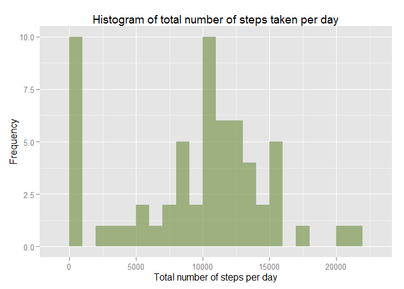
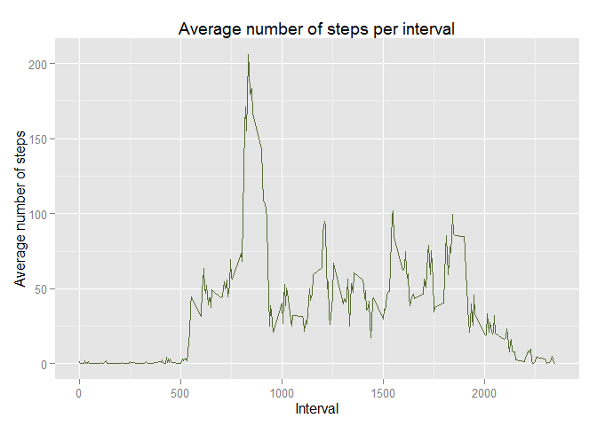
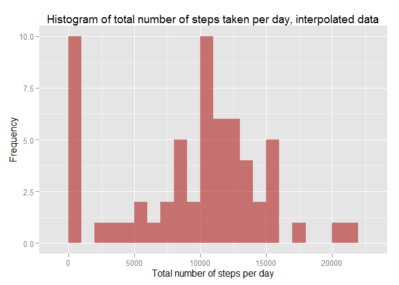
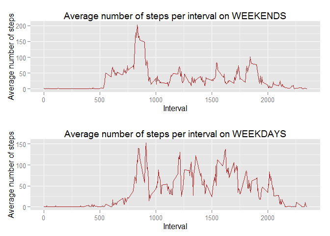

# Reproducible Research: Peer Assessment 1
rowroll  
29-Mar-2016  


## Loading and preprocessing the data

******

Show any code that is needed to

1. Load the data (i.e. `read.csv()`)
2. Process/transform the data (if necessary) into a format suitable for your analysis

******

We begin by loading libraries we will use

```r
library(dplyr)
library(ggplot2)
library(gridExtra)
library(lubridate)
```

Next, we load in the data.  We assume the data file is local:


```r
actData <- read.csv("activity.csv")
```

Finally, we change the type of the date column to the POSIXct date format:

```r
actData$date <- ymd(actData$date)
```

This is what `actData` looks like:

```r
str(actData)
```

```
## 'data.frame':	17568 obs. of  3 variables:
##  $ steps   : int  NA NA NA NA NA NA NA NA NA NA ...
##  $ date    : POSIXct, format: "2012-10-01" "2012-10-01" ...
##  $ interval: int  0 5 10 15 20 25 30 35 40 45 ...
```


## What is mean total number of steps taken per day?

******

For this part of the assignment, you can ignore the missing values in the dataset.

1. Make a histogram of the total number of steps taken each day
2. Calculate and report the **mean** and **median** total number of steps taken per day

******

To answer this question, we begin by finding the total number of steps taken per day

```r
totalStepsPerDay <- actData %>% group_by(date) %>%
  summarize(stepsPerDay = sum(steps, na.rm=TRUE))
str(totalStepsPerDay)
```

```
## Classes 'tbl_df', 'tbl' and 'data.frame':	61 obs. of  2 variables:
##  $ date       : POSIXct, format: "2012-10-01" "2012-10-02" ...
##  $ stepsPerDay: int  0 126 11352 12116 13294 15420 11015 0 12811 9900 ...
##  - attr(*, "drop")= logi TRUE
```


Here is the histogram of the number of steps taken per day


```r
ggplot(totalStepsPerDay, aes(x=stepsPerDay)) + 
  geom_histogram(binwidth=1000, fill="darkolivegreen4", alpha=0.6) +
  ggtitle("Histogram of total number of steps taken per day") +
  labs(x = "Total number of steps per day", y = "Frequency")
```

 


The mean total number of steps taken per day is then

```r
mean(totalStepsPerDay$stepsPerDay)
```

```
## [1] 9354.23
```


The median total number of steps taken per day is then

```r
median(totalStepsPerDay$stepsPerDay)
```

```
## [1] 10395
```


## What is the average daily activity pattern?

*****

1. Make a time series plot (i.e. type = "l") of the 5-minute interval (x-axis) and the average number of steps taken, averaged across all days (y-axis)

2. Which 5-minute interval, on average across all the days in the dataset, contains the maximum number of steps?

*****


To answer this question, we begin by calculating the average number of steps per interval:


```r
meanStepsPerInterval <- actData %>% group_by(interval) %>%
  summarize(stepsPerInterval = mean(steps, na.rm=TRUE))
str(meanStepsPerInterval)
```

```
## Classes 'tbl_df', 'tbl' and 'data.frame':	288 obs. of  2 variables:
##  $ interval        : int  0 5 10 15 20 25 30 35 40 45 ...
##  $ stepsPerInterval: num  1.717 0.3396 0.1321 0.1509 0.0755 ...
##  - attr(*, "drop")= logi TRUE
```


We plot this average against time:


```r
ggplot(meanStepsPerInterval, aes(x=interval, y=stepsPerInterval)) + 
  geom_line(color="darkolivegreen") +
  ggtitle("Average number of steps per interval") +
  labs(x = "Interval", y = "Average number of steps")
```

 

The interval with the maximum number of steps, on average over all the days in the dataset, is


```r
maxIndex <- which.max(meanStepsPerInterval$stepsPerInterval)
meanStepsPerInterval$interval[maxIndex]
```

```
## [1] 835
```


## Imputing missing values

******

Note that there are a number of days/intervals where there are missing values (coded as NA). The presence of missing days may introduce bias into some calculations or summaries of the data.

1. Calculate and report the total number of missing values in the dataset (i.e. the total number of rows with NAs)
2. Devise a strategy for filling in all of the missing values in the dataset. The strategy does not need to be sophisticated. For example, you could use the mean/median for that day, or the mean for that 5-minute interval, etc.
3. Create a new dataset that is equal to the original dataset but with the missing data filled in.
4. Make a histogram of the total number of steps taken each day and calculate and report the **mean** and **median** total number of steps taken per day. Do these values differ from the estimates from the first part of the assignment? What is the impact of imputing missing data on the estimates of the total daily number of steps?

******

We begin by finding the total number of rows with NAs:


```r
sum(is.na(actData$steps))
```

```
## [1] 2304
```

We use linear interpolation to fill in the missing values in the dataset.  Using `rule = 2` means that the value at the closest data extreme is used when NAs are on the edges.


```r
xAxis <- 5*(0:(nrow(actData)-1))
stepsInterpolated = approx(x = xAxis, y = actData$steps, xout=xAxis, method="linear", rule=2)
actData$stepsInterpolated <- stepsInterpolated$y
```

We check to see if there are any NAs in the interpolated data.

```r
sum(is.na(actData$stepsInterpolated))
```

```
## [1] 0
```

As we can see, there are no NAs in the interpolated data.

We also calculate how many steps were added to the dataset using our interpolation


```r
wasNA <- is.na(actData$steps)
sum(actData$stepsInterpolated[wasNA])
```

```
## [1] 0
```

It appears that the NAs in the original data are all surrounded by rows with 0 steps, so **the interpolation adds zero new steps**.

As requested, we create a new dataset, equal to the original dataset, but with the missing values filled in:


```r
actDataInterp <- select(actData, steps = stepsInterpolated, date, interval)
str(actDataInterp)
```

```
## 'data.frame':	17568 obs. of  3 variables:
##  $ steps   : num  0 0 0 0 0 0 0 0 0 0 ...
##  $ date    : POSIXct, format: "2012-10-01" "2012-10-01" ...
##  $ interval: int  0 5 10 15 20 25 30 35 40 45 ...
```

We recalculate the total number of steps per day, using the interpolated data

```r
totalStepsPerDayInterp <- actDataInterp %>% group_by(date) %>%
  summarize(stepsPerDayInterp = sum(steps, na.rm=TRUE))
str(totalStepsPerDayInterp)
```

```
## Classes 'tbl_df', 'tbl' and 'data.frame':	61 obs. of  2 variables:
##  $ date             : POSIXct, format: "2012-10-01" "2012-10-02" ...
##  $ stepsPerDayInterp: num  0 126 11352 12116 13294 ...
##  - attr(*, "drop")= logi TRUE
```


Here is the histogram of the number of steps taken per day


```r
ggplot(totalStepsPerDayInterp, aes(x=stepsPerDayInterp)) + 
  geom_histogram(binwidth=1000, fill="firebrick", alpha=0.6) +
  ggtitle("Histogram of total number of steps taken per day, interpolated data") +
  labs(x = "Total number of steps per day", y = "Frequency")
```

 


The mean total number of steps taken per day is then

```r
mean(totalStepsPerDayInterp$stepsPerDayInterp)
```

```
## [1] 9354.23
```


The median total number of steps taken per day is then

```r
median(totalStepsPerDayInterp$stepsPerDayInterp)
```

```
## [1] 10395
```


Unsurprisingly, The difference between the **means** is

```r
mean(totalStepsPerDay$stepsPerDay) - mean(totalStepsPerDayInterp$stepsPerDayInterp)
```

```
## [1] 0
```

and, the difference between the **medians** is

```r
median(totalStepsPerDay$stepsPerDay) - median(totalStepsPerDayInterp$stepsPerDayInterp)
```

```
## [1] 0
```

As calculated previously, the total daily number of steps, in this particular dataset, **does not change** when linear interpolation is used to fill in missing values.


## Are there differences in activity patterns between weekdays and weekends?

******

For this part the `weekdays()` function may be of some help here. Use the dataset with the filled-in missing values for this part.

1. Create a new factor variable in the dataset with two levels – “weekday” and “weekend” indicating whether a given date is a weekday or weekend day.
2. Make a panel plot containing a time series plot (i.e. type = "l") of the 5-minute interval (x-axis) and the average number of steps taken, averaged across all weekday days or weekend days (y-axis). See the README file in the GitHub repository to see an example of what this plot should look like using simulated data.

******

The function `wday()`  returns the day of the week as a decimal number (01-07, Sunday is 1) if `label=FALSE`.


```r
actDataInterp$dayNumber <- wday(actDataInterp$date, label=FALSE)
weekEndIndex <- actDataInterp$dayNumber %in% c(1, 7) 

actDataInterp$dayType = "Weekday"
actDataInterp$dayType[weekEndIndex] = "Weekend"
```


We begin by calculating the average number of steps per interval on weekdays:


```r
meanStepsPerWeekdayIntervalInterp <- actDataInterp %>% 
  filter(dayType == "Weekday")  %>%
  group_by(interval) %>%
  summarize(stepsPerWeekdayInterval = mean(steps))

meanStepsPerWeekendIntervalInterp <- actDataInterp %>% 
  filter(dayType == "Weekend")  %>%
  group_by(interval) %>%
  summarize(stepsPerWeekendInterval = mean(steps))
```


We plot this average against time:


```r
plotWeekends <- ggplot(meanStepsPerWeekendIntervalInterp, aes(x=interval, y=stepsPerWeekendInterval)) + 
  geom_line(color="firebrick") +
  ggtitle("Average number of steps per WEEKDAY interval") +
  labs(x = "Interval", y = "Average number of steps")


plotWeekdays <- ggplot(meanStepsPerWeekdayIntervalInterp, aes(x=interval, y=stepsPerWeekdayInterval)) + 
  geom_line(color="firebrick") +
  ggtitle("Average number of steps per WEEKEND interval") +
  labs(x = "Interval", y = "Average number of steps")

grid.arrange( plotWeekdays, plotWeekends, ncol=1)
```

 


